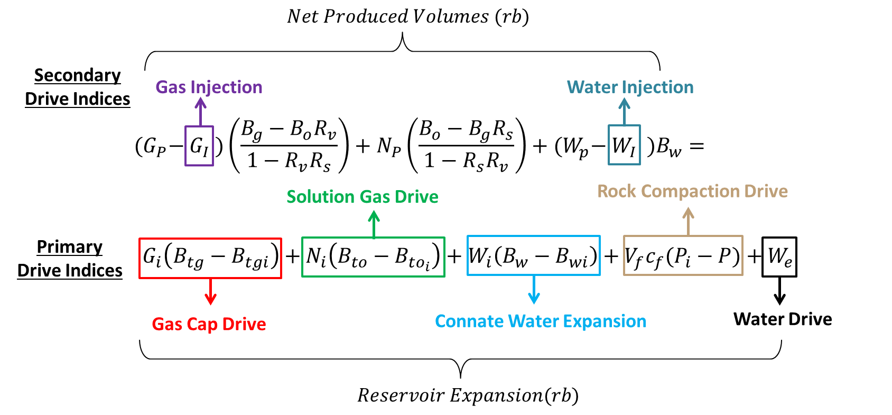
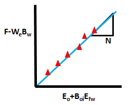

# **Analyzing with Pytank**

Pytank main objective is to estimate the original oil in place (OOIP), using
the material balance as the main tool. That is why two important concepts have
to be taken into account, which are the **subsurface withdrawal** and the
**average pressure**.

The calculation of average pressures and subway withdrawal are key concepts in
reservoir engineering, especially when performing a material balance analysis
and determining the behavior of a reservoir in terms of production and reserves.
Below is a description of each, their relationship and their importance in the
context of a reservoir's POES (Production, Operation, Efficiency and
Sustainability) analysis.

## **Average Pressure**

The average pressure in a reservoir refers to the average pressure found in the
reservoir during a given period. This calculation is made from pressure
measurements taken at different times and locations within the reservoir. The
average pressure is crucial to understanding how reservoir conditions vary as
fluids are withdrawn.

## **Underground Withdrawal**

Underground withdrawal refers to the amount of fluids (oil, gas and water) that
are extracted from the reservoir through the wells. This calculation considers
cumulative production and is used to evaluate the efficiency of resource
extraction in the reservoir. Subsurface withdrawal is essential to determine how
fluid withdrawal affects pressure and saturation in the reservoir.

Average pressure and drawdown are interrelated in the analysis of reservoir
behavior. As subsurface drawdown occurs, the pressure in the reservoir tends to
decrease. This, in turn, can affect the reservoir's ability to continue
producing fluids efficiently. Therefore, a proper analysis of both parameters is
critical to understanding the state of the reservoir and predicting its future
behavior.

## **Importance in OOIP Analysis**

OOIP analysis focuses on the production, operation, efficiency and
sustainability of a reservoir. Average pressure and subsurface withdrawal are
critical components in this analysis for several reasons:

- **Reservoir Evaluation**: Knowing the average pressure allows engineers to
  estimate the original volume of oil and gas in the reservoir. This is
  fundamental to production planning and reservoir management.
- **Production Optimization**: Monitoring subsurface withdrawal helps engineers
  adjust production strategies. If the subway withdrawal is too high and the
  average pressure is decreasing rapidly, it may be necessary to change the
  extraction technique or implement enhanced recovery methods.
- **Predicting Reservoir Behavior**: By analyzing the relationship between
  average
  pressure and drawdown, engineers can predict how the reservoir will respond to
  different production scenarios. This is essential for making informed
  decisions about field operation.
- **Sustainability**: Proper management of subsurface pressure and drawdown is
  key to reservoir sustainability. Maintaining pressure at optimal levels helps
  extend reservoir life and maximize resource recovery.

## **Campbell Method**

In a real case, many times there will be no information about the presence or absence of
an aquifer and its characteristics. If you do not have an accurate description of the
aquifer, you cannot get a more realistic prediction of the behavior of the reservoir.


- **<span style="color:sienna">Horizontal straight line</span>**: indicates a purely
  volumetric system without any water influx. The reservoir's energy comes exclusively
  from the expansion of oil, dissolved gas in the liquid, and the standard component of
  compaction drive.
- **<span style="color:red">Slight upward trend</span>**: implies that the reservoir has
  been supported by a moderate water drive.
- **<span style="color:blue">Steep upward trend</span>**: indicates a robust water-drive
  system where the aquifer exhibits infinite-acting characteristics.
- **<span style="color:navy">Declining trend</span>**: suggests the presence of a weak
  water drive.

The Campbell method is used in reservoir engineering to analyze the energy
contribution of an aquifer in relation to oil production. This method allows the
relationship between cumulative oil production (Np) and aquifer energy (F/Eo +
Efw) to be graphed, making it easier to visualize how the aquifer affects
reservoir production.

The importance of the Campbell method lies in its ability to provide a graphical
representation of the influence of the aquifer on oil production. By performing
a material balance analysis, engineers can determine how aquifer energy
contributes to oil recovery. This is essential for:

- **Optimizing production**: Understanding the relationship between production
  and aquifer energy allows engineers to adjust production strategies to
  maximize hydrocarbon recovery.
- **Evaluating reserves**: The method helps estimate the volume of oil that can
  be recovered, which is crucial for production planning and reserve evaluation.

## **Material Balance**

The material balance equation is based on the principle of conservation of mass,
establishing a relationship between the original volume of hydrocarbons and the volumes
produced, as well as the changes in the properties of the fluids throughout the
production process. This equation can be expressed as follows:



To apply the material balance equation, the following must be considered:

- Constant pore volume.
- Thermodynamic equilibrium between reservoir fluids.
- Processes at the same temperature.
- Negligible formation and formation water compressibility effects.
- Closed and homogeneous system.
- Representative PVT information

## **Havlena-Odeh method**

The Havlena and Odeh method is fundamental to the material balance equation (MBE),
especially in the context of petroleum reservoir engineering. This approach allows the
EBM to be represented as a straight line, which facilitates the estimation of key
parameters such as the original amount of oil in situ and reservoir behavior under
different production conditions.

The material balance equation was significantly reduced to the following equation.

$$
F = N (E_o + E_{fw} + m E_g) + W_e
$$

Where each term represents:

- **F**: Fluids produced from the reservoir.
- **N**: Original In Situ Oil (POES)
- **Eo**: Oil expansion
- **Efw**: Expansion of connate and formation water
- **Eg**: Expansion of Gas
- **m**: Gas layer
- **We**: Water Influx

For Sub-saturated Reservoirs, assuming that during the production process of a reservoir
there is no injection of fluids to improve its production, from the equation described
above several terms can be eliminated such as:

- **m**: Being an under saturated reservoir there will be no associated gas layer.
- **Rs** = **Rsi** = **Rp**: The gas is dissolved in the oil.
- **We**: Assuming that initially there is no aquifer present.

So equation would be expressed as follows for under saturated reservoir:

$$
F = N(E_o + E_{fw})
$$

From the equation developed, a theoretical graph is obtained that attempts to predict
the behavior of an under saturated reservoir, in which the fluids produced by the
reservoir (F) are related to the expansion of the fluids (Eo + Efw), where it is assumed
that the slope must be an approximate value to the OOIP (N).



The Havlena-Odeh method is essential in material balance analysis for the
following reasons:

- **Calculation of OOIP**: This method allows the calculation of the inferred
  OOIP (Original-Oil-in-Place), which is essential for assessing the amount of
  oil that can be recovered from a field. Accuracy in the estimation of POES is
  vital for planning and decision-making in the exploitation of the field.
- **Comparison of pressures**: The method allows the comparison of observed
  pressure with calculated pressure, helping to identify discrepancies that may
  indicate problems in the field or in the modelling of the aquifer.
- **Aquifer modeling**: By incorporating aquifer models such as Fetkovich and
  Carter-Tracy, the method provides a robust framework for understanding how the
  aquifer affects oil production, which is crucial for effective resource
  management.

## **Analysis Class**

The Analysis class includes a private method called `_pressure_vol_avg`, which
is responsible for calculating the average pressure in the reservoir. This
method uses underground pressure and withdrawal data to determine the average
pressure over time. Average pressure is crucial to understanding how fluid
extraction affects reservoir conditions and to predict future reservoir
behavior.

The class also includes a private method called `_calc_uw`, which calculates
underground withdrawal per well. This method combines production and pressure
data to determine how much fluid has been removed from the reservoir.
Underground removal is essential to assess production efficiency and how it
affects pressure in the reservoir.

Pytank allows you to use two important graphical methods in the process so that
you can perform the respective analysis of your data: `Campbell` and
`Havlena & Odeh`.

### **Campbell Method**

The campbell_plot function generates a Campbell chart that illustrates the
relationship between cumulative oil output (Np) and aquifer energy (F/Eo + Efw).
This visualization is essential to understanding how the energy of the aquifer
contributes to oil recovery.

#### **Function campbell_plot**

You can use this function to plot the relationship between Np and F/Eo + Efw, allowing
you to visually assess the influence of the aquifer on production. In addition, you can
choose to plot a regression line or a custom line to analyze specific trends.

```
fig = tank.campbell_plot(custom_line=True, x1=100, y1=0.5, x2=200, y2=0.6)
```

#### **Function campbell_data**

Also allows to obtain a DataFrame with the data used for the Campbell plot, facilitating
numerical analysis and data manipulation for reports or further studies.

```
campbell_df = tank.campbell_data()
```

### **Havlena and Odeh Method**

This graph allows you to calculate the OOIP (Original Oil in Place). There are
two options to create the chart:

- Using the Campbell method, the presence of an aquifer can be inferred,
  indicating that a non-volumetric sub-saturated layer is being worked.
- In the absence of an energy supply, it is considered a volumetric
  sub-saturated reservoir.

#### **Function havlena_odeh_plot**

You can use this function to visualize the relationship between Eo + Efw and F - We,
helping to identify patterns and trends in production. A regression line or custom line
can also be plotted for more detailed analysis.

```
fig_havlena = tank.havlena_odeh_plot(custom_line=False)
```

#### **Function Havlena_oded_data**

This function will allow you to obtain a DataFrame containing the data used for the
Havlena and Odeh plot, which will allow you to perform further analysis and perform
additional calculations based on this data.

```
havlena_df = tank.havlena_oded_data()
```

### **Analytical Method**

This method is based on an inferred OOIP, which is used to recalculate a
synthetic pressure. The inferred POES is relevant when the pressure observed in
the reservoir shows a behavior similar to the calculated synthetic pressure. In
this case, it can be confirmed that the POES is suitable for the matter balance
equation.

#### **Function analytic_method**

Usage: this function allows to calculate the inferred POES and compare the observed
pressure with the calculated pressure, using aquifer models such as Fetkovich and
Carter-Tracy. This is essential to validate the reservoir model and optimize production.

```yaml
pressure_data = tank.analytic_method(poes=5000, option=“data”)
```

```yaml
fig_pressure = tank.analytic_method(poes=5000, option=“plot”)
```

For more information on the Analysis class you can review its
[documentation](../API/generated/analysis_api.md).
